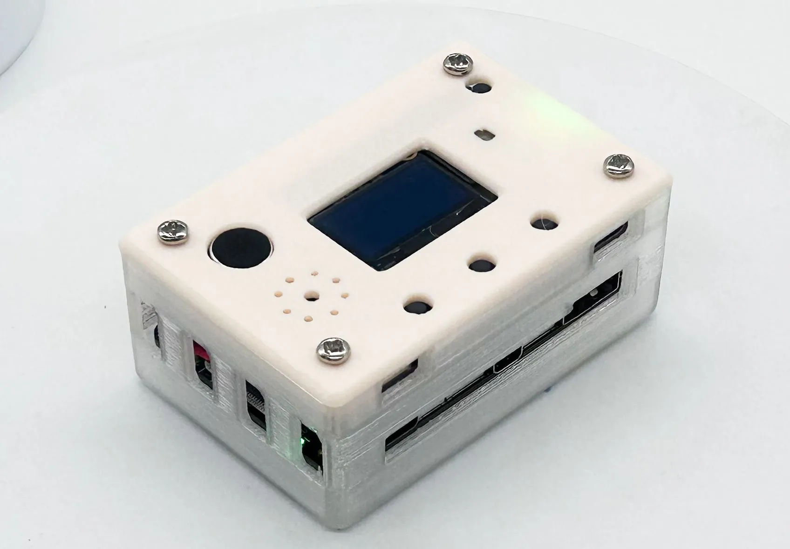

[简体中文](README.md) | [English](README_en.md)

# TaishanPi AIBox firmware

This repository's [GitHub Actions](.github/workflows/build-image.yml) creates a flashable image from [ophub's lckfb-tspi Armbian image](https://github.com/ophub/amlogic-s9xxx-armbian/releases/tag/Armbian_resolute_arm64_server_2026.09). The base is fixed to `Armbian_26.11.0_rockchip_lckfb-tspi_resolute_6.1.157_server_2026.09.01.img.gz` (SHA256 `247d8aad854c3bd0d9ba2fd755678967a6f7e59e91b89e1d331fae4f8bba01e6`), consistent with the running TaishanPi kernel and device tree. The build does not recompile the kernel, nor does it introduce any subsequent changes to the device tree upstream.

The image includes an offline voice assistant, SSD1306 OLED/three-button menu/LED PWM support, RKNPU SenseVoice Chinese speech recognition, CPU fallback recognition, Xiaoya Chinese TTS, and Ollama Qwen3 0.6B and 1.7B. The NPU is used only for speech recognition. Downloads use pinned SHA256 checksums; the image contains no Wi-Fi passwords, SSH private keys, or personal board configuration.

## Physical hardware



The image shows the AIBox hardware. The source page describes an earlier software version; refer to this repository for current firmware features.

[Hardware project and image source](https://oshwhub.com/course-examples/ai-rk3566)

## One-click deployment on existing Armbian

For ARM64 TaishanPi running Ubuntu 26.04 `resolute` with `rk3566-taishanpi-v10.dtb`; no image flashing is needed. Connect the board to the Internet and run:

```sh
git clone https://github.com/JasonYANG170/tspi-AIBox.git
cd tspi-AIBox
sudo bash install.sh
```

The script installs missing dependencies and models, runs application tests, enables and starts the `ollama` and `ai` services. Download the files and verify SHA256 one by one; running it again will reuse the existing model. Existing `/var/lib/eda-aibox/settings.json`, `led.json`, ASR/TTS backend selections, and Ollama models are retained; pre-update code and service files are saved in `/opt/eda-aibox/backups/`. If the LED overlay is enabled for the first time, hardware PWM will not take effect until a reboot. Post-deployment checks:

```sh
systemctl status ai ollama
journalctl -u ai -n 50 --no-pager
```

## CI build and flash

Run **Actions → Build TaishanPi image → Run workflow** manually in this repository, or push the relevant files to `main`. After a successful build, download the `tspi-aibox-armbian-6.1.157` artifact, extract its `.img.zst`, and run:

```sh
sha256sum -c tspi-AIBox_lckfb-tspi_resolute_6.1.157_YYYYMMDD.img.zst.sha256
zstd -d tspi-AIBox_lckfb-tspi_resolute_6.1.157_YYYYMMDD.img.zst
# 核对目标设备路径后刷写；本命令会覆盖整张卡
sudo dd if=tspi-AIBox_lckfb-tspi_resolute_6.1.157_YYYYMMDD.img of=/dev/目标设备 bs=4M status=progress conv=fsync
```

The image partition is expanded to 12 GiB, so the target storage must have at least 12 GiB. On first boot, follow the standard Armbian serial-console setup to create an account and configure networking. The assistant uses the pre-created `yang` system account; services start once the audio device is ready. After logging in, check:

```sh
systemctl status ai ollama
journalctl -u ai -b --no-pager | tail -50
cat /sys/kernel/debug/rknpu/load
```

The current program assumes the sound card is `plughw:1,0`, the OLED is at I2C-2 address `0x3c`, the AHT10 is at I2C-2 address `0x38`, and the buttons are at GPIO3_A1/A2/A3. AHT10 has experienced reading failures on existing boards; the program will prompt a sensor failure. When starting up for the first time, you still need to check the peripherals according to the actual wiring. For detailed functions, performance and limitations, see [Deployment Notes](DEPLOYMENT.md).

## Local builds

Running on ARM64 Ubuntu 26.04 with loop device and root privileges:

```sh
sudo apt-get install gdisk parted e2fsprogs zstd bzip2 curl device-tree-compiler
sudo bash scripts/build-image.sh
```

Output is saved to `out/`, and downloads are cached in `.cache/image-build/`. The build script verifies the base image, runs application tests that do not require peripherals, validates both Ollama models, and generates the image SHA256 checksum.

The pre-trained models come from their respective upstreams, and their licenses should be checked when using them; the Xiaoya model card indicates that the training data is used in non-commercial scenarios.
